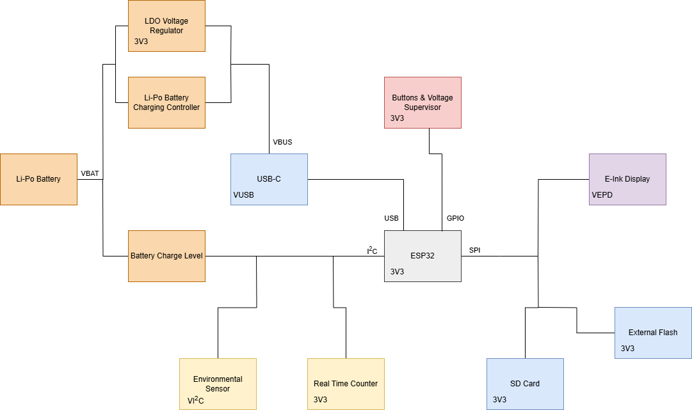
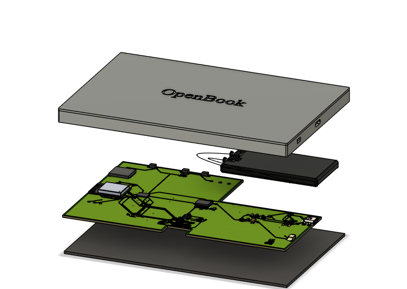

###### Copyright Sabin Padurariu 2025

# E-Book Reader

## General Overview

OpenBook is a compact electronic device designed around the ESP32 microcontroller. This device integrates several key features, including:

* Li-Po battery charging and power management
* E-Paper display for visual output
* Environmental sensing capabilities with the BME688 sensor
* Real-Time Clock (RTC) functionality using the DS3231SN
* SD Card slot for data storage
* External NOR Flash memory
* USB-C connectivity

## Bill of Materials

| Name | Price Link | Datasheet Link |
|----------------|----------------|----------------|		
|	BOOT_BUTTON	|	https://www.snapeda.com/parts/EVQP7L01P/Panasonic/view-part/?welcome=home&ref=search&t=evqp7l01p	|	https://industry.panasonic.com/global/en/downloads?tab=catalog&small_g_cd=203&part_no=EVQPUJ02K	|
|	C1	|	https://componentsearchengine.com/part-view/CC0402MRX5R5BB106/YAGEO	|	https://componentsearchengine.com/Datasheets/2/CC0402MRX5R5BB106.pdf	|
|	C1_BAT	|	https://componentsearchengine.com/part-view/CC0402MRX5R5BB106/YAGEO	|	https://componentsearchengine.com/Datasheets/2/CC0402MRX5R5BB106.pdf	|
|	C1_BAT1	|	https://www.snapeda.com/parts/CC0402DRNPO9BN5R1/Yageo/view-part/?ref=dk&t=LTSPICE_CC0402&con_ref=None	|	https://s3.amazonaws.com/snapeda/datasheet/CC0402DRNPO9BN5R1_Yageo.pdf	|
|	C2_BAT1	|	https://www.snapeda.com/parts/CC0402DRNPO9BN5R1/Yageo/view-part/?ref=dk&t=LTSPICE_CC0402&con_ref=None	|	https://s3.amazonaws.com/snapeda/datasheet/CC0402DRNPO9BN5R1_Yageo.pdf	|
|	C1_BAT2	| https://www.snapeda.com/parts/CC0402DRNPO9BN5R1/Yageo/view-part/?ref=dk&t=LTSPICE_CC0402&con_ref=None	|	https://s3.amazonaws.com/snapeda/datasheet/CC0402DRNPO9BN5R1_Yageo.pdf	|
|	C2	|	https://componentsearchengine.com/part-view/CC0402MRX5R5BB106/YAGEO	|	https://componentsearchengine.com/Datasheets/2/CC0402MRX5R5BB106.pdf	|
|	C2_BAT	|	https://componentsearchengine.com/part-view/CC0402MRX5R5BB106/YAGEO	|	https://componentsearchengine.com/Datasheets/2/CC0402MRX5R5BB106.pdf	|
|	C3	|	https://componentsearchengine.com/part-view/T491B107M006AT/KEMET	|	https://s3.amazonaws.com/snapeda/datasheet/TAJB475K025RNJ_AVX.pdf	|
|	C4	|	https://componentsearchengine.com/part-view/CC0402MRX5R5BB106/YAGEO	|	https://componentsearchengine.com/Datasheets/2/CC0402MRX5R5BB106.pdf	|
|	C4_USB	|	https://componentsearchengine.com/part-view/CC0402MRX5R5BB106/YAGEO	|	https://componentsearchengine.com/Datasheets/2/CC0402MRX5R5BB106.pdf	|
|	C5	|	https://componentsearchengine.com/part-view/CC0402MRX5R5BB106/YAGEO	|	https://componentsearchengine.com/Datasheets/2/CC0402MRX5R5BB106.pdf	|
|	C5_USB	|	https://componentsearchengine.com/part-view/CC0402MRX5R5BB106/YAGEO	|	https://componentsearchengine.com/Datasheets/2/CC0402MRX5R5BB106.pdf	|
|	C6	|	https://componentsearchengine.com/part-view/CC0402MRX5R5BB106/YAGEO	|	https://componentsearchengine.com/Datasheets/2/CC0402MRX5R5BB106.pdf	|
|	C7	|	https://componentsearchengine.com/part-view/CC0402MRX5R5BB106/YAGEO	|	https://componentsearchengine.com/Datasheets/2/CC0402MRX5R5BB106.pdf	|
|	C8	|	https://componentsearchengine.com/part-view/CC0402MRX5R5BB106/YAGEO	|	https://componentsearchengine.com/Datasheets/2/CC0402MRX5R5BB106.pdf	|
|	C9	|	https://www.snapeda.com/parts/CC0402DRNPO9BN5R1/Yageo/view-part/?ref=dk&t=LTSPICE_CC0402&con_ref=None	|	https://s3.amazonaws.com/snapeda/datasheet/CC0402DRNPO9BN5R1_Yageo.pdf	|
|	C10	|	https://componentsearchengine.com/part-view/CC0402MRX5R5BB106/YAGEO	|	https://componentsearchengine.com/Datasheets/2/CC0402MRX5R5BB106.pdf	|
|	C10_SUPERCAP	|	https://www.snapeda.com/parts/CPH3225A/Seiko+Instruments/view-part/?ref=eda	|	https://www.snapeda.com/parts/CPH3225A/Seiko%20Instruments/datasheet/	|
|	CHANGE_BUTTON	|	https://www.snapeda.com/parts/EVQP7L01P/Panasonic/view-part/?welcome=home&ref=search&t=evqp7l01p	|	https://industry.panasonic.com/global/en/downloads?tab=catalog&small_g_cd=203&part_no=EVQPUJ02K	|
|	CHG_LED	|	https://www.snapeda.com/parts/KP-1608SURCK/Kingbright/view-part/?ref=search&t=LED%200603	|	https://www.snapeda.com/parts/KP-1608SURCK/Kingbright/datasheet/	|
|	C_DELAY	|	https://componentsearchengine.com/part-view/CC0402MRX5R5BB106/YAGEO	|	https://componentsearchengine.com/Datasheets/2/CC0402MRX5R5BB106.pdf	|
|	D1	|	https://www.snapeda.com/parts/USBLC6-2SC6Y/STMicroelectronics/view-part/?ref=snap	|	https://www.snapeda.com/parts/USBLC6-2SC6Y/STMicroelectronics/datasheet/	|
|	D2	|	https://ro.mouser.com/ProductDetail/KYOCERA-AVX/SD0805S020S1R0?qs=jCA%252BPfw4LHbpkAoSnwrdjw%3D%3D	|	http://datasheets.avx.com/schottky.pdf	|
|	D3	|	https://www.snapeda.com/parts/MBR0530/Onsemi/view-part/?ref=eda	|	https://www.snapeda.com/parts/MBR0530/ON%20Semiconductor/datasheet/	|
|	D4	|	https://www.snapeda.com/parts/MBR0530/Onsemi/view-part/?ref=eda	|	https://www.snapeda.com/parts/MBR0530/ON%20Semiconductor/datasheet/	|
|	D5	|	https://www.snapeda.com/parts/MBR0530/Onsemi/view-part/?ref=eda	|	https://www.snapeda.com/parts/MBR0530/ON%20Semiconductor/datasheet/	|
|	D6	|	https://www.snapeda.com/parts/PGB1010603MR/Littelfuse/view-part/?ref=eda	|	https://www.snapeda.com/parts/PGB1010603MR/Littelfuse%20Inc./datasheet/	|
|	D7	|	https://ro.mouser.com/ProductDetail/KYOCERA-AVX/SD0805S020S1R0?qs=jCA%252BPfw4LHbpkAoSnwrdjw%3D%3D	|	http://datasheets.avx.com/schottky.pdf	|
|	D8	|	https://www.snapeda.com/parts/PGB1010603MR/Littelfuse/view-part/?ref=eda	|	https://www.snapeda.com/parts/PGB1010603MR/Littelfuse%20Inc./datasheet/	|
|	D9	|	https://www.snapeda.com/parts/PGB1010603MR/Littelfuse/view-part/?ref=eda	|	https://www.snapeda.com/parts/PGB1010603MR/Littelfuse%20Inc./datasheet/	|
|	D10	|	https://www.snapeda.com/parts/PGB1010603MR/Littelfuse/view-part/?ref=eda	|	https://www.snapeda.com/parts/PGB1010603MR/Littelfuse%20Inc./datasheet/	|
|	D11	|	https://www.snapeda.com/parts/PGB1010603MR/Littelfuse/view-part/?ref=eda	|	https://www.snapeda.com/parts/PGB1010603MR/Littelfuse%20Inc./datasheet/	|
|	D12	|	https://www.snapeda.com/parts/PGB1010603MR/Littelfuse/view-part/?ref=eda	|	https://www.snapeda.com/parts/PGB1010603MR/Littelfuse%20Inc./datasheet/	|
|	EPD_C1	|	https://componentsearchengine.com/part-view/CC0402MRX5R5BB106/YAGEO	|	https://componentsearchengine.com/Datasheets/2/CC0402MRX5R5BB106.pdf	|
|	EPD_C2	|	https://componentsearchengine.com/part-view/CC0402MRX5R5BB106/YAGEO	|	https://componentsearchengine.com/Datasheets/2/CC0402MRX5R5BB106.pdf	|
|	EPD_C5	|	https://componentsearchengine.com/part-view/CC0402MRX5R5BB106/YAGEO	|	https://componentsearchengine.com/Datasheets/2/CC0402MRX5R5BB106.pdf	|
|	EPD_C6	|	https://componentsearchengine.com/part-view/CC0402MRX5R5BB106/YAGEO	|	https://componentsearchengine.com/Datasheets/2/CC0402MRX5R5BB106.pdf	|
|	EPD_C7	|	https://componentsearchengine.com/part-view/CC0402MRX5R5BB106/YAGEO	|	https://componentsearchengine.com/Datasheets/2/CC0402MRX5R5BB106.pdf	|
|	EPD_C8	|	https://componentsearchengine.com/part-view/CC0402MRX5R5BB106/YAGEO	|	https://componentsearchengine.com/Datasheets/2/CC0402MRX5R5BB106.pdf	|
|	EPD_C9	|	https://componentsearchengine.com/part-view/CC0402MRX5R5BB106/YAGEO	|	https://componentsearchengine.com/Datasheets/2/CC0402MRX5R5BB106.pdf	|
|	EPD_C10	|	https://componentsearchengine.com/part-view/CC0402MRX5R5BB106/YAGEO	|	https://componentsearchengine.com/Datasheets/2/CC0402MRX5R5BB106.pdf	|
|	EPD_C11	|	https://componentsearchengine.com/part-view/CC0402MRX5R5BB106/YAGEO	|	https://componentsearchengine.com/Datasheets/2/CC0402MRX5R5BB106.pdf	|
|	EPD_C12	|	https://componentsearchengine.com/part-view/CC0402MRX5R5BB106/YAGEO	|	https://componentsearchengine.com/Datasheets/2/CC0402MRX5R5BB106.pdf	|
|	IC1	|	https://componentsearchengine.com/part-view/BD5229G-TR/ROHM%20Semiconductor	|	https://datasheet.datasheetarchive.com/originals/distributors/Datasheets_SAMA/f2b9741ef86007909f138d561a359946.pdf	|
|	IC4	|	https://componentsearchengine.com/part-view/XC6220A331MR-G/Torex	|	https://product.torexsemi.com/system/files/series/xc6220.pdf	|
|	J1	|	https://componentsearchengine.com/part-view/FH34SRJ-24S-0.5SH(99)/Hirose	|	https://www.hirose.com/en/product/document?clcode=CL0580-1255-6-99&productname=FH34SRJ-24S-0.5SH(99)&series=FH34SRJ&documenttype=2DDrawing&lang=en&documentid=0000990903	|
|	J2	|	https://componentsearchengine.com/part-view/USB4110-GF-A/GCT%20(GLOBAL%20CONNECTOR%20TECHNOLOGY)	|	https://gct.co/files/drawings/usb4110.pdf	|
|	J3	|	https://componentsearchengine.com/part-view/SM04B-SRSS-TB(LF)(SN)/JST%20(JAPAN%20SOLDERLESS%20TERMINALS)	| - |
|	J4	|	https://store.comet.srl.ro/Catalogue/Product/43497/	|	https://store.comet.srl.ro/Catalogue/Product/43497/	|
|	L1	|	https://ro.mouser.com/ProductDetail/Wurth-Elektronik/744043680?qs=PGXP4M47uW6VkZq%252BkzjrHA%3D%3D	|	https://www.we-online.com/components/products/datasheet/744043680.pdf	|
|	PFMF.050.1	|	https://ro.mouser.com/ProductDetail/EPCOS-TDK/B72520T0350K062?qs=dEfas%2FXlABIszF52uu7vrg%3D%3D	|	https://www.mouser.co.uk/ProductDetail/EPCOS-TDK/B72520T0350K062?qs=dEfas%2FXlABIszF52uu7vrg%3D%3D	|
|	Q1	|	https://componentsearchengine.com/part-view/DMG2305UX-7/Diodes%20Incorporated	|	https://www.diodes.com//assets/Datasheets/DMG2305UX.pdf	|
|	Q2	|	https://componentsearchengine.com/part-view/DMG2305UX-7/Diodes%20Incorporated	|	https://www.diodes.com//assets/Datasheets/DMG2305UX.pdf	|
|	Q3	|	https://componentsearchengine.com/part-view/SI1308EDL-T1-GE3/Vishay	|	https://componentsearchengine.com/Datasheets/1/SI1308EDL-T1-GE3.pdf	|
|	R1	|	https://componentsearchengine.com/part-view/R0402%201%25%20100%20K%20(RC0402FR-07100KL)/YAGEO	|	https://www.yageo.com/upload/media/product/products/datasheet/rchip/PYu-RC_Group_51_RoHS_L_12.pdf	|
|	R1-PINH	|	https://componentsearchengine.com/part-view/R0402%201%25%20100%20K%20(RC0402FR-07100KL)/YAGEO	|	https://www.yageo.com/upload/media/product/products/datasheet/rchip/PYu-RC_Group_51_RoHS_L_12.pdf	|
|	R1-PINH1	|	https://componentsearchengine.com/part-view/R0402%201%25%20100%20K%20(RC0402FR-07100KL)/YAGEO	|	https://www.yageo.com/upload/media/product/products/datasheet/rchip/PYu-RC_Group_51_RoHS_L_12.pdf	|
|	R1_BAT	|	https://componentsearchengine.com/part-view/R0402%201%25%20100%20K%20(RC0402FR-07100KL)/YAGEO	|	https://www.yageo.com/upload/media/product/products/datasheet/rchip/PYu-RC_Group_51_RoHS_L_12.pdf	|
|	R1_PWRUSB	|	https://componentsearchengine.com/part-view/R0402%201%25%20100%20K%20(RC0402FR-07100KL)/YAGEO	|	https://www.yageo.com/upload/media/product/products/datasheet/rchip/PYu-RC_Group_51_RoHS_L_12.pdf	|
|	R2	|	https://componentsearchengine.com/part-view/R0402%201%25%20100%20K%20(RC0402FR-07100KL)/YAGEO	|	https://www.yageo.com/upload/media/product/products/datasheet/rchip/PYu-RC_Group_51_RoHS_L_12.pdf	|
|	R2-PINH	|	https://componentsearchengine.com/part-view/R0402%201%25%20100%20K%20(RC0402FR-07100KL)/YAGEO	|	https://www.yageo.com/upload/media/product/products/datasheet/rchip/PYu-RC_Group_51_RoHS_L_12.pdf	|
|	R2-PINH1	|	https://componentsearchengine.com/part-view/R0402%201%25%20100%20K%20(RC0402FR-07100KL)/YAGEO	|	https://www.yageo.com/upload/media/product/products/datasheet/rchip/PYu-RC_Group_51_RoHS_L_12.pdf	|
|	R2-USB	|	https://componentsearchengine.com/part-view/R0402%201%25%20100%20K%20(RC0402FR-07100KL)/YAGEO	|	https://www.yageo.com/upload/media/product/products/datasheet/rchip/PYu-RC_Group_51_RoHS_L_12.pdf	|
|	R2-USB1	|	https://componentsearchengine.com/part-view/R0402%201%25%20100%20K%20(RC0402FR-07100KL)/YAGEO	|	https://www.yageo.com/upload/media/product/products/datasheet/rchip/PYu-RC_Group_51_RoHS_L_12.pdf	|
|	R2_BAT	|	https://componentsearchengine.com/part-view/R0402%201%25%20100%20K%20(RC0402FR-07100KL)/YAGEO	|	https://www.yageo.com/upload/media/product/products/datasheet/rchip/PYu-RC_Group_51_RoHS_L_12.pdf	|
|	R3	|	https://componentsearchengine.com/part-view/R0402%201%25%20100%20K%20(RC0402FR-07100KL)/YAGEO	|	https://www.yageo.com/upload/media/product/products/datasheet/rchip/PYu-RC_Group_51_RoHS_L_12.pdf	|
|	R4	|	https://componentsearchengine.com/part-view/R0402%201%25%20100%20K%20(RC0402FR-07100KL)/YAGEO	|	https://www.yageo.com/upload/media/product/products/datasheet/rchip/PYu-RC_Group_51_RoHS_L_12.pdf	|
|	R5	|	https://componentsearchengine.com/part-view/R0402%201%25%20100%20K%20(RC0402FR-07100KL)/YAGEO	|	https://www.yageo.com/upload/media/product/products/datasheet/rchip/PYu-RC_Group_51_RoHS_L_12.pdf	|
|	R6	|	https://componentsearchengine.com/part-view/R0402%201%25%20100%20K%20(RC0402FR-07100KL)/YAGEO	|	https://www.yageo.com/upload/media/product/products/datasheet/rchip/PYu-RC_Group_51_RoHS_L_12.pdf	|
|	R7	|	https://componentsearchengine.com/part-view/R0402%201%25%20100%20K%20(RC0402FR-07100KL)/YAGEO	|	https://www.yageo.com/upload/media/product/products/datasheet/rchip/PYu-RC_Group_51_RoHS_L_12.pdf	|
|	R8	|	https://componentsearchengine.com/part-view/R0402%201%25%20100%20K%20(RC0402FR-07100KL)/YAGEO	|	https://www.yageo.com/upload/media/product/products/datasheet/rchip/PYu-RC_Group_51_RoHS_L_12.pdf	|
|	R9	|	https://componentsearchengine.com/part-view/R0402%201%25%20100%20K%20(RC0402FR-07100KL)/YAGEO	|	https://www.yageo.com/upload/media/product/products/datasheet/rchip/PYu-RC_Group_51_RoHS_L_12.pdf	|
|	R10	|	https://componentsearchengine.com/part-view/R0402%201%25%20100%20K%20(RC0402FR-07100KL)/YAGEO	|	https://www.yageo.com/upload/media/product/products/datasheet/rchip/PYu-RC_Group_51_RoHS_L_12.pdf	|
|	RESET_BUTTON	|	https://www.snapeda.com/parts/EVQP7L01P/Panasonic/view-part/?welcome=home&ref=search&t=evqp7l01p	|	https://industry.panasonic.com/global/en/downloads?tab=catalog&small_g_cd=203&part_no=EVQPUJ02K	|
|	R_BOOT	|	https://componentsearchengine.com/part-view/R0402%201%25%20100%20K%20(RC0402FR-07100KL)/YAGEO	|	https://www.yageo.com/upload/media/product/products/datasheet/rchip/PYu-RC_Group_51_RoHS_L_12.pdf	|
|	R_CAPACITOR	|	https://componentsearchengine.com/part-view/R0402%201%25%20100%20K%20(RC0402FR-07100KL)/YAGEO	|	https://www.yageo.com/upload/media/product/products/datasheet/rchip/PYu-RC_Group_51_RoHS_L_12.pdf	|
|	R_CHANGE	|	https://componentsearchengine.com/part-view/R0402%201%25%20100%20K%20(RC0402FR-07100KL)/YAGEO	|	https://www.yageo.com/upload/media/product/products/datasheet/rchip/PYu-RC_Group_51_RoHS_L_12.pdf	|
|	R_CL1	|	https://componentsearchengine.com/part-view/R0402%201%25%20100%20K%20(RC0402FR-07100KL)/YAGEO	|	https://www.yageo.com/upload/media/product/products/datasheet/rchip/PYu-RC_Group_51_RoHS_L_12.pdf	|
|	R_RESET	|	https://componentsearchengine.com/part-view/R0402%201%25%20100%20K%20(RC0402FR-07100KL)/YAGEO	|	https://www.yageo.com/upload/media/product/products/datasheet/rchip/PYu-RC_Group_51_RoHS_L_12.pdf	|
|	SENSOR2	|	https://www.snapeda.com/parts/BME680/Bosch/view-part/?welcome=home	|	https://www.snapeda.com/parts/BME680/Bosch%20Sensortec/datasheet/	|
|	SJ1	|	https://grabcad.com/library/solder-jumpers-1	|	https://www.digikey.com/en/htmldatasheets/production/1809569/0/0/1/jumpers	|
|	U1	|	https://www.snapeda.com/parts/W25Q512JVEIQ/Winbond+Electronics/view-part/?ref=eda	|	https://www.snapeda.com/parts/W25Q512JVEIQ/Winbond%20Electronics/datasheet/	|
|	U2	|	https://www.snapeda.com/parts/ESP32-C6-WROOM-1-N8/Espressif+Systems/view-part/?ref=eda	|	https://www.snapeda.com/parts/ESP32-C6-WROOM-1-N8/Espressif%20Systems/datasheet/	|
|	U3	|	https://www.snapeda.com/parts/DS3231SN%23/Analog%20Devices/view-part/?ref=dk&t=DS3231SN%23&con_ref=None	|	https://www.snapeda.com/parts/DS3231SN%23/Analog%20Devices/datasheet/	|
|	U4	|	https://www.snapeda.com/parts/MAX17048G+T10/Analog+Devices/view-part/?ref=eda	|	https://www.snapeda.com/parts/MAX17048G+T10/Analog%20Devices/datasheet/	|
|	U5	|	https://ro.mouser.com/ProductDetail/Microchip-Technology/MCP73831T-2ACI-OT?qs=yUQqVecv4qvbBQBGbHx0Mw%3D%3D	|	https://ro.mouser.com/datasheet/2/268/MCP73831_Family_Data_Sheet_DS20001984H-3441711.pdf	|

## Functionality

The schematic highlights the interconnection of these components, with the ESP32 acting as the central processing unit, coordinating data acquisition, processing, and display.

## Modules

At its core, Openbook consists of five main modules:

* Power and battery module
* Processing module
* General Devices Module
* I/O Devices Module
* Display Module

### Processing and Calculations

The ESP32 processes data from the sensors and controls the RGB LED module. Calculations are performed to convert the raw sensor data into relevant units of measurement.

Power consumption calculations:

* ESP32 in active mode consumes around 5mA
* ESP32 in sleep mode consumes around 5µA
* The temperature and humidity sensor consume approximately 2.5mA

Battery life estimations:

* in normal mode expected lifetime is about 12 weeks
* in performance mode expected lifetime is about 6 weeks

## ESP32 GPIO

The ESP32-C6 utilizes its General Purpose Input/Output (GPIO) pins to interface with various peripherals.  Based on the schematic, here are some notable GPIO connections:

* **E-Paper Display:** The ESP32 communicates with the E-Paper display via several GPIOs through the FFC connector. These GPIOs are responsible for transmitting data and control signals to update the display.
* **SD Card:** GPIOs are dedicated to the SD Card interface, enabling the ESP32 to read from and write data to the SD card.
* **BME688 Sensor:** The ESP32 communicates with the BME688 environmental sensor using GPIOs for data transfer and control.
* **RTC Module (DS3231SN):** GPIOs are used to communicate with the DS3231SN RTC module to maintain accurate timekeeping.
* **Control Buttons:** GPIOs are connected to the Reset and Boot buttons, allowing user interaction and device control.

### SPI and I2C Communication Protocols

The ESP32-C6 employs both SPI and I2C serial communication protocols to interact with peripherals:

* **SPI (Serial Peripheral Interface):** SPI is a synchronous serial communication interface used for short-distance communication, particularly in embedded systems.  In this design, SPI is likely used to communicate with the **external NOR Flash memory** and the **SD Card**. SPI involves a master-slave architecture with dedicated lines for:
    * **SCK (Serial Clock):** Provides the clock signal for synchronization
    * **MOSI (Master Out Slave In):** Data line from the master to the slave
    * **MISO (Master In Slave Out):** Data line from the slave to the master
    * **CS (Chip Select):** Used by the master to select a specific slave device

* **I2C (Inter-Integrated Circuit):** I2C is another serial communication protocol that uses only two wires:
    * **SDA (Serial Data):** Carries the data
    * **SCL (Serial Clock):** Carries the clock signal

I2C is used for communication with the **RTC module** and the **Environmental sensor** as seen in the schematic. I2C supports multiple devices on the same bus using addressing, making it suitable for communicating with several slower peripherals.

